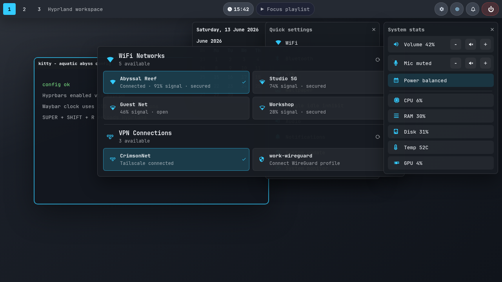
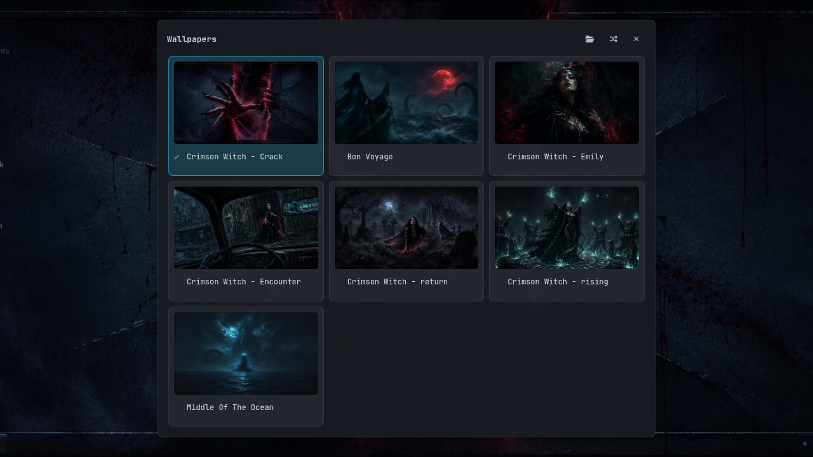

# Acquatic Abyss

An advanced, keyboard-first Hyprland desktop inspired by the deep sea, bioluminescence, and the timeless cosmic horror of the Great Old Ones.



The screenshot is a sanitized mock preview, not a live desktop capture.

## Features

| Area | What is included |
| :--- | :--- |
| Compositor | Hyprland Lua config, Dwindle layout, blur, animated borders, sane keybindings |
| Visibility | Hyprbars titlebars, compact Waybar clock, styled calendar tooltip, clear status buttons |
| Controls | AGS quick settings for WiFi, Bluetooth, VPN/Tailscale, wallpaper, idle inhibit, audio, updates, and notifications |
| Monitoring | AGS system stats popup for CPU, RAM, disk, temperature, GPU, power profile, and volume/mic controls |
| Help | AGS shortcut overlay with grouped keybinding reference |
| Monitors | HyprDynamicMonitors clamshell profiles for laptop and external display setups |
| Lock/Idle | Hypridle and Hyprlock with DPMS handling |
| Wallpaper | Hyprpaper startup, AGS thumbnail picker, random/apply actions, wallpaper rotation helper |
| Power | Wlogout layer-shell power menu |
| Screenshots | Hyprshot region/window capture piped into Satty |

## Install

This setup targets Arch/CachyOS-style systems. For a step-by-step walkthrough
on a fresh machine (login, network, update, install — CachyOS as the example),
see [INSTALL.md](INSTALL.md).

One-liner with dependencies, config install, Hyprbars setup, and Hyprland start:

```bash
curl -fsSL https://raw.githubusercontent.com/crimsonclyde/Acquatic-Abyss/master/install.sh | bash -s -- --deps --plugins --start
```

Config-only install after dependencies are already present:

```bash
curl -fsSL https://raw.githubusercontent.com/crimsonclyde/Acquatic-Abyss/master/install.sh | bash
```

Manual clone:

```bash
git clone https://github.com/crimsonclyde/Acquatic-Abyss.git ~/Documents/Repositories/github/Acquatic-Abyss
cd ~/Documents/Repositories/github/Acquatic-Abyss
./install.sh --deps --plugins
```

The installer clones or updates the repo, symlinks config directories into `~/.config`, and backs up existing config directories to `~/.config/hypr_backup_<timestamp>`.

## Installer Options

| Option | Action |
| :--- | :--- |
| `--deps` | Install required packages with `pacman` and AUR packages with `paru` or `yay` |
| `--plugins` | Run `hyprpm update`, add `hyprwm/hyprland-plugins`, enable `hyprbars`, and reload plugins |
| `--start` | Start Hyprland from a TTY, or reload if Hyprland is already running |
| `-h`, `--help` | Show installer help |

Package groups used by `--deps`:

```bash
sudo pacman -S --needed hyprland waybar wofi wlogout network-manager-applet blueman brightnessctl pamixer hypridle hyprlock hyprpaper hyprshot swaync upower jq lm_sensors power-profiles-daemon wireplumber cliphist wl-clipboard satty nwg-displays ksshaskpass git base-devel gum pavucontrol
paru -S --needed hyprdynamicmonitors-bin waypaper aylurs-gtk-shell
```

The terminal, browser, and file manager are not in the core list — the
installer installs whichever ones you pick (defaults: kitty, chromium,
nautilus).

The installer is interactive (menus via `gum`, plain prompts as fallback;
piped `curl | bash` runs use the defaults everywhere). It asks:

- **Desktop shell** — **classic** (Waybar + AGS menus + Hyprbars — deprecated
  but complete, the default) or **noctalia** (Quickshell bar, menus, and OSD —
  newer, beta; adds the `noctalia-git` AUR package). Stored as `AA_BACKEND`.
- **Default applications** — the terminal, browser, and file manager launched
  by the desktop keybindings; the picked apps are installed with `--deps`.
- **Wallpapers** — copy the bundled set to `~/Pictures/Wallpapers` (never
  overwrites existing files).
- **Optional modules** — one multi-select menu (see [Modules](#modules)).

All choices land in `~/.config/aquatic-abyss/config.env` and can be changed
there at any time; if that file already exists the installer keeps it and asks
nothing. Generic shell keybindings fall back to the classic stack
automatically if the selected backend is not running.

`--plugins` additionally installs the toolchain hyprpm needs to compile
Hyprland headers and plugins:

```bash
sudo pacman -S --needed base-devel cmake meson cpio git
```

If you use `yay` instead of `paru`, the installer will use it automatically.

Packages for optional features (VPN, optional apps, fan control, …) are not in
the core list — each module ships its own package list and the installer asks
per module. See [Modules](#modules).

## Uninstall

The installer symlinks config directories into `~/.config` and backs up
whatever was there before to `~/.config/hypr_backup_<timestamp>`. To uninstall:
remove the symlinks in `~/.config` (`hypr`, `ags`, `waybar`, and the other
directories listed in `install.sh`), restore the backup directory if you want
your old config back, and delete the cloned repository. Installed packages and
any `/etc/sudoers.d/zz-aquatic-*` files can be removed with your package
manager and `sudo rm` respectively.

## User configuration

App choices are not hardcoded. Defaults live in `config/defaults.env`; to
override them, copy that file to `~/.config/aquatic-abyss/config.env` (the
installer offers to do this) and edit:

```bash
AA_BACKEND="classic"
AA_TERMINAL="kitty"
AA_BROWSER="chromium --disable-vulkan --ozone-platform=wayland"
AA_FILE_MANAGER="nautilus"
AA_MENU="wofi --show drun"
AA_IDE="vscodium"
AA_UPDATE_CMD="cachy-update"
```

`AA_BACKEND` selects the desktop backend behind the generic shell actions
(launcher, notifications, control centre, wallpaper, OSD, lock, session UI).
Keybindings and bar buttons call the `scripts/aa/aa-*` wrapper commands, and
the wrappers dispatch to the selected backend. Two backends exist: `classic`
(the Waybar/wofi/swaync/AGS stack) and `noctalia` (the Noctalia shell —
requires the `noctalia-git` package; config in `.config/noctalia/`). The
startup in `hyprland.lua` launches the matching stack. Unknown values, and
any Noctalia call that fails at runtime, fall back to classic with a warning.

Machine-specific module settings (VPN accounts, Bluetooth devices) also live
under `~/.config/aquatic-abyss/` — see each module's README and `.env.example`.
Nothing personal ever needs to be committed to this repository.

## Modules

Optional features live in `modules/` and are discovered dynamically —
menu rows, keybinds, packages, and sudoers rules all ship inside the module
directory. The rule is **hidden, not broken**: a module that cannot work on
your machine (missing tool, missing hardware, missing configuration) simply
does not appear in any menu, instead of showing a dead button.

| Module | What it does | Appears when |
| :--- | :--- | :--- |
| `wifi` | WiFi network picker (`SUPER + SHIFT + W`) | a WiFi interface exists |
| `vpn-tailscale` | VPN/Tailscale picker (`SUPER + SHIFT + V`) | `tailscale` or a NetworkManager VPN profile exists |
| `framework-fan` | Fan control row (ChromeOS-EC laptops, e.g. Framework) | `/dev/cros_ec` + `ectool` exist |
| `bt-soundbar` | One-key Bluetooth speaker toggle (`SUPER + SHIFT + B`) | `bluetoothctl`, an adapter, **and** a configured device exist |
| `apps-extra` | Keybinds for optional apps (Element, Joplin, Signal) | always listed; each bind registers only if its app is installed |

`bt-soundbar` requires one-time configuration: copy
`modules/bt-soundbar/bt-soundbar.env.example` to
`~/.config/aquatic-abyss/bt-soundbar.env` and set your paired device's MAC
address. Until then the module stays hidden.

To write your own module, read [`modules/README.md`](modules/README.md) — a
module is one directory with a small `module.sh` CLI, and menus pick it up on
their next open without restarting anything.

## Keybindings

`SUPER + key` opens applications and manages windows; `SUPER + SHIFT + key`
controls Aquatic Abyss panels, services, and hardware integrations (see
[docs/KEYBINDING-REVIEW.md](docs/KEYBINDING-REVIEW.md) for the full scheme).

| Key | Action |
| :--- | :--- |
| `SUPER + RETURN` | Open terminal (Kitty) |
| `SUPER + B` | Open browser (Chromium) |
| `SUPER + E` | Open file manager (Nautilus) |
| `SUPER + I` | Open IDE (VSCodium) |
| `SUPER + SPACE` | Open app launcher (Wofi) |
| `SUPER + H` | Toggle shortcut overlay |
| `SUPER + ESCAPE` | Open Wlogout (lock, logout, shutdown) |
| `SUPER + SHIFT + Q` | Toggle Quick Settings |
| `SUPER + SHIFT + T` | Toggle System Stats panel |
| `SUPER + SHIFT + R` | Reload Hyprland |
| `SUPER + SHIFT + U` | Run system update |
| `SUPER + Q` | Kill active window |
| `SUPER + F` | Toggle fullscreen |
| `SUPER + V` | Toggle floating |
| `SUPER + P` | Toggle pseudo tiling |
| `SUPER + G` | Toggle split direction |
| `SUPER + S` | Toggle special workspace |
| `SUPER + SHIFT + S` | Move window to special workspace |
| `SUPER + Arrow` | Move focus |
| `SUPER + SHIFT + Arrow` | Move window |
| `SUPER + CTRL + Arrow` | Resize window |
| `SUPER + [0-9]` | Switch workspace |
| `SUPER + SHIFT + [0-9]` | Move window to workspace |
| `SUPER + M` | Open nwg-displays |
| `SUPER + SHIFT/CTRL/ALT + M` | Monitor rescue (internal off / on / re-apply) |
| `PRINT` | Screenshot region |
| `SHIFT + PRINT` | Screenshot window |

`SUPER + RETURN`, `+ B`, `+ E`, `+ I`, and `+ SPACE` honor your
[user configuration](#user-configuration). Additional keybinds come from
[modules](#modules): `SUPER + SHIFT + B` toggles the Bluetooth soundbar once
configured, `SUPER + SHIFT + W` / `+ V` open the WiFi and VPN pickers, and
`apps-extra` binds optional apps only when installed.

### Shortcut Overlay

Press `SUPER + H` to toggle the centered shortcut overlay. It runs as an AGS layer-shell overlay via `scripts/shortcut-overlay.sh`, so it appears above current windows without taking a workspace or becoming a tiled app window. Press `SUPER + H` again, `Esc`, or the close button to hide it.

Shortcut data is maintained in `.config/ags/shortcut-overlay.json`. Add or edit entries by changing the relevant section object:

```json
{ "key": "SUPER + Example", "action": "Describe the action" }
```

The view and styling live in `.config/ags/shortcut-overlay.tsx` and `.config/ags/shortcut-overlay.css`. Dependencies are the existing AGS stack used by the other popups; no additional package is required beyond the configured `aylurs-gtk-shell` dependency.

## Wallpaper

Put personal wallpapers here:

```bash
~/Pictures/Wallpapers
```

The quick settings `Wallpaper` button opens an AGS thumbnail picker with:

- larger image previews in a centered grid
- active wallpaper highlighting
- click-to-apply through Hyprpaper
- random wallpaper action
- folder shortcut for `~/Pictures/Wallpapers`



If no personal wallpaper is selected, the startup script falls back to:

```bash
/usr/share/hypr
```

Related mockup:

```bash
docs/mockups/wallpaper-picker-preview.html
```

## Validation

Useful checks after editing:

```bash
luac -p .config/hypr/hyprland.lua modules/*/binds.lua
Hyprland --verify-config --config .config/hypr/hyprland.lua
hyprdynamicmonitors validate --config .config/hyprdynamicmonitors/config.toml
bash -n install.sh scripts/*.sh scripts/lib/*.sh scripts/aa/aa-* modules/*/module.sh
bash scripts/lib/modules.sh manifest | jq .
```

## Security & privacy

The repository ships no personal data: committed configuration is defaults and
empty `*.env.example` templates only, and everything machine-specific belongs
in `~/.config/aquatic-abyss/` outside the repo. Module sudoers rules are
installed per-module after `visudo -cf` validation as
`/etc/sudoers.d/zz-aquatic-<module>` and grant only the specific commands the
module needs.
